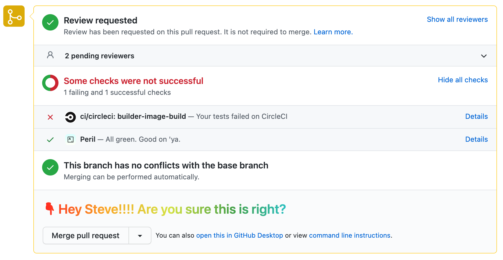

# [TamperMonkey](https://chrome.google.com/webstore/detail/tampermonkey/dhdgffkkebhmkfjojejmpbldmpobfkfo?hl=en) scripts

## [github-warn-squash-or-merge.js](./github-warn-squash-or-merge.js)

Conditionally adds a hard-to-miss warning above the merge/squash button so that I don't accidentally squash a Deploy PR or merge a non-Deploy PR. 

